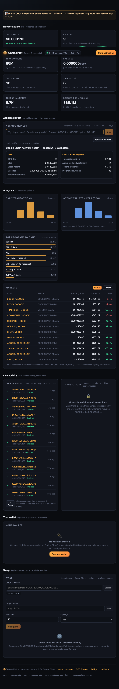

# 🍪 CookiePilot

**An AI-native analytics + execution dashboard for [Cookie Chain](https://www.cookiechain.wtf)** — live network pulse, natural-language chain console, wallet, real-time transaction tracking, and keyless swap quotes. Dark, fast, and 100% free to run: no API keys, no paid services, no secrets.

**Live: https://cookiepilot.netlify.app**



---

## Why this wins the "AI-powered dApps" lane

CookiePilot's **Ask console** turns plain English into live chain queries — *"top movers"*, *"what's in my wallet"*, *"quote 10 COOK to bCOOK"*, *"price of CHAT"*, *"network health"*, *"bridge stats"* — answered in under a second from real APIs. It is a **deterministic local intent engine** (pattern match → entity resolution over the token registry → query execution), which means:

- zero paid AI APIs (a hard rule: zero spend),
- zero keys, zero setup, works offline for parsing,
- every answer cites its source and renders structured, clickable data.

For fully agentic trading, the ecosystem's official **[cookie-mcp](https://github.com/cookiechain/cookie-mcp)** server (`npx cookie-mcp`) gives AI agents swap/launch/LP/stake/bridge tools — read-only without a key. CookiePilot is the human cockpit alongside it; the Help answer in the console links to it.

## Features

| Area | What you get |
| --- | --- |
| **Network pulse** | COOK price + 24h change, live TPS, tx counts, base fee (0.000005 COOK/sig), supply, validators, epoch progress, tokens/programs launched, Hyperlane bridge totals — auto-refreshing |
| **Ask CookiePilot** | Deterministic NL console over the same live APIs (10+ intents, chips, structured cards) |
| **Analytics** | Daily transactions, active wallets + fees charts, top programs by txns, token registry board, live pools/venues table (Cookiebox DAMM/CLMM, Cookieswap, Raydium, Meteora DBC…) |
| **Live activity** | Streaming signature feed for the SPL Token program with in-place status upgrades: `processed → confirmed → finalized` — Cookie Chain's sub-second finality, visible |
| **Transactions** | Memo ping + COOK transfer. Every send gets a **live confirmation timeline** with millisecond timings per stage, plus a graceful, actionable failure path |
| **Wallet** | **Nightly** (the wallet Cookie Chain's docs recommend) first, plus Phantom / Backpack / Solflare / standard-injection wallets. Balance in COOK, SPL token positions with USD values, NFTs via the official **Cookie DAS API**, indexed history |
| **Swap** | Keyless multi-route **quotes** via the Cookieswap (Candy Shop) router across all chain DEX liquidity; execution is simulate-then-sign with your own wallet (non-custodial, optional) |
| **Zero-spend demo** | Everything above works read-only with **no wallet and no funds**. Wallet/tx features light up when a wallet connects |

Error states and empty states everywhere — API down, wallet locked, no tokens, no NFTs, no route, insufficient funds (with faucet link), rejected signature: all handled inline.

## Quick start

```bash
npm install
npm run dev        # http://localhost:5183
npm run build      # typecheck + production bundle → dist/
npm run preview    # serve the production build locally
```

No environment variables. No `.env`. Nothing to configure.

## Deploy

One-command deploys (free tiers, no credit card):

```bash
npm run deploy:netlify   # uses netlify.toml (redirect proxies) — verified working
npm run deploy:vercel    # uses vercel.json (rewrites)
```

Cloudflare Pages also works out of the box: `public/_redirects` is included (build: `npm run build`, output: `dist`).

**The proxies matter:** `swap.cookiescan.io` sends no CORS headers, so the app calls it through same-origin rewrites (`/swap-api/*`, `/explorer-api/*`, `/chain-api/*`, `/agg-api/*`) that each platform configures at the edge. The RPC (`rpc.cookiescan.io`) sends `access-control-allow-origin: *` and is called directly; the WebSocket (`wss.cookiescan.io`) is documented for event subscriptions.

## Architecture

```
src/
  lib/
    config.ts     Cookie Chain endpoints, well-known programs, proxy bases
    rpc.ts        Minimal JSON-RPC client (timeout/retry) + typed results
    api.ts        Cookiescan REST (stats/analytics/bridge/registry/markets/price/history)
                  + Candy Shop quote client, shape-normalizing included
    wallet.ts     Standard SVM wallet detection (Nightly-first) + bs58 + signing types
    txs.ts        Tx builders (memo, transfer), send + confirmation-phase tracker
    nlq.ts        Deterministic NL intent engine (10+ intents → live queries)
    format.ts     Number/USD/address/time formatting (string-safe)
  hooks/
    useWallet.ts  Wallet state context (connect, balance, sendTransaction)
    usePoll.ts    Interval polling with error capture + manual refresh
  components/     Header, StatTiles, NetworkPanel, MarketsPanel, ActivityFeed,
                  WalletPanel, TxPanel (+TxTracker), SwapPanel, AskPanel, charts, ui
```

**Data sources (all verified live 2026-09-06, curl-tested before wiring):**

| Source | Endpoint | Used for |
| --- | --- | --- |
| Cookie Chain RPC | `https://rpc.cookiescan.io` (WS: `wss.cookiescan.io`) | slot/TPS samples, supply, balances, token accounts, signature feeds, status polling, tx send, blockhash, simulation |
| Cookie DAS API | `https://api.cookiescan.io` (JSON-RPC POST) | `getAssetsByOwner` for wallet NFTs; also serves `/api/tokens`, `/api/markets`, `/api/price/cook` |
| Cookiescan explorer API | `https://cookiescan.io/api/*` | `/mainnet/stats`, `/analytics/daily`, `/bridge/stats`, `/tokens?search=`, `/address/{addr}/transactions` |
| Cookieswap (Candy Shop) | `https://swap.cookiescan.io/api/*` | `/quote/multi-route` (keyless), `/swap-tx/multi-route` (unsigned tx for optional execution), `/submit-tx`, `/confirm-tx/{sig}` |
| Cookiebox aggregator | `https://agg.cookiebox.app` | alternate quote venue (proxied, unused by default) |

Official docs followed: [docs.cookiechain.wtf](https://docs.cookiechain.wtf) (getting started, wallets, developer guide, ecosystem genesis programs, bridge), explorer developer-tools, and the official [cookie-mcp](https://github.com/cookiechain/cookie-mcp) (linked from the docs' developer-tools page → `github.com/cookiechain` org). Note for auditors: `docs.cookiechain.wtf` also links a `docs.cookeiscan.wtf` domain (DNS-dead as of this writing) — the live docs above are the operative ones.

## The capital story (verified, zero-spend)

Cookie Chain is a **single community-run mainnet** (Agave 4.1.2, ~1s slots, sub-second finality). There is **no devnet or testnet** — the docs, explorer and tooling all point at the one community RPC. What that means for money:

| Item | Cost (measured 2026-09-06) |
| --- | --- |
| COOK USD price | ≈ $0.000113 |
| Transaction fee | 0.000005 COOK per signature ≈ **$0.00000057** |
| **COOK Faucet** ([cookoven.xyz/faucet](https://cookoven.xyz/faucet), listed in the explorer's official Developer Tools) | **5 COOK free** per claim (follow Cook Oven on X) ≈ enough for **~1,000,000 transactions** |
| Program deploy | Rent-exempt deposit in COOK; ~100 KB ≈ 0.7 COOK (Solana-numeraire rent). The bounty's "≈ $0.05" is the right order of magnitude and is **covered by ~4 faucet claims** (or one, for smaller programs) |
| Alternative funding | 1:1 bridge from Solana via [Hyperlane](https://hyperlane.cookiescan.io) |

**How this demo costs the builder $0:**

1. The whole dashboard is a **read-only demo** against live chain data — no wallet needed to judge it.
2. Connecting a wallet costs nothing and shows balances/tokens/NFTs (even for empty wallets).
3. Sending a transaction requires fees, which the **faucet's 5 COOK** covers ~a million times over; the UI links the faucet inline whenever funds are missing.
4. Swap execution is gated behind a funded wallet by design; quotes are free and keyless.

## Security notes

- No secrets in the repo — there is nothing to leak (no keys, no paid APIs).
- Swaps are **simulated on-chain before signing**; execution only ever signs locally with the connected wallet (non-custodial). Quote + route building is serverless and keyless.
- The NL console cannot move money — it is read-only by construction.

## Known gaps / honest limits

- **No WebSocket usage yet** — activity uses 3–4 s polling of `getSignaturesForAddress`; `wss.cookiescan.io` is documented and would make the feed push-based.
- **Launchpad data** (MomoSwap bonding curves) is not surfaced; the swap panel explains "no route" for pre-graduation tokens. `cookie-mcp`'s launchpad tools cover this on-chain.
- The NL console is **deterministic**, not conversational — by design (zero-spend rule). It answers ~10 intent families and falls back to token search.
- The explorer history endpoint covers recent indexed txs per address (paginated); deep history belongs to Cookiescan.
- `cookoven.xyz` (faucet host) intermittently fails plain curl checks (TLS fingerprinting?) — it loads in browsers; the explorer lists it as the official faucet.
- Registry "holders"/"market cap" figures are indexer estimates (Coinscan's own numbers).

## Credits & links

- Cookie Chain: [site](https://www.cookiechain.wtf) · [docs](https://docs.cookiechain.wtf) · [explorer](https://cookiescan.io) · [X](https://x.com/TheCookieChain)
- Official MCP server: [cookiechain/cookie-mcp](https://github.com/cookiechain/cookie-mcp) (`npx cookie-mcp`)
- Official CLI: [cookiechain/cookie-cli](https://github.com/cookiechain/cookie-cli)
- Swap venue: [Cookieswap / Candy Shop](https://swap.cookiescan.io/markets) · Bridge: [Hyperlane warp route](https://hyperlane.cookiescan.io) · Faucet: [Cook Oven](https://cookoven.xyz/faucet)

Built for the Cookie Chain "Build a cApp" bounty. MIT.
