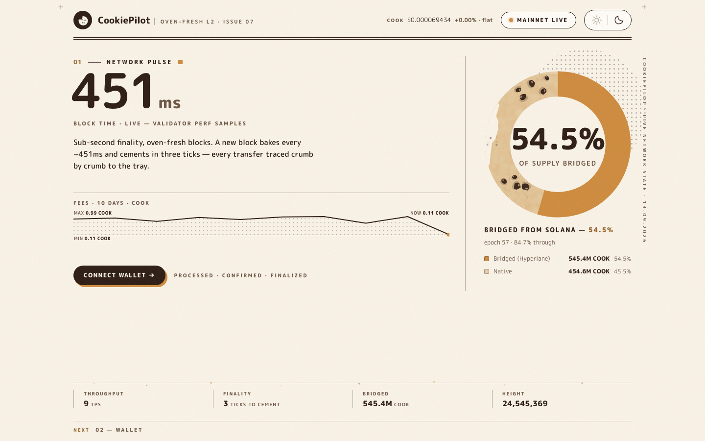
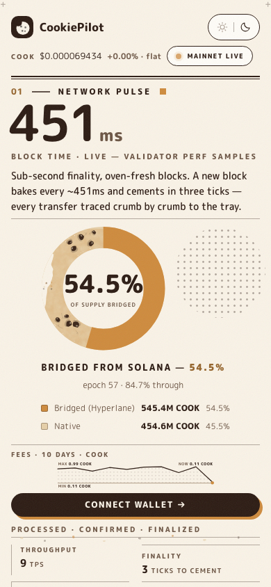

# 🍪 CookiePilot

**An AI-native analytics + execution dashboard for [Cookie Chain](https://www.cookiechain.wtf)** — live network pulse, natural-language chain console, wallet, real-time transaction tracking, and keyless swap quotes. Warm bakery design, fast, and 100% free to run: no API keys, no paid services, no secrets.

**Live: https://cookiepilot.netlify.app**





---

## Design system v8 — "honesty floor" (v6.5 → v7 fold-law → v8 trust-the-data; DESIGN-SYSTEM.md v2–v8, every pass gate-verified)

Warm, precise, community-native: vanilla/cocoa **dual theme, light-first**, one-click sun|moon toggle top-right (`aria-pressed`, persisted in `localStorage`). One self-hosted rounded family. Signature geometry = **the bitten stuffed ring** (a real bite, not a scallop) + **Crumb Trail** (static tx-state stations) + **Oven** (ambient feed motion). Flat editorial paper: sharp-cornered cards on ink hairlines — depth comes from rules, not blur or shadows.

### The hero (v6.4 "HERO B", CEO-ruled) — block time at poster scale

The first viewport is a poster with one job: the sub-second story.

- **Masthead:** logo · **MAINNET LIVE** pill (dot carries live/offline) · **COOK price as a plain-text chip** (exact USD, tabular, delta obeys the glyph law — no pill chrome) · sun|moon toggle.
- **The one giant number: LIVE MS/BLOCK** — from validator performance samples (`getRecentPerformanceSamples`), typically ~430–520 ms, refit to its column on every resize/font-load (cap 150 px desktop / 72 px mobile, floor 14 px so it survives the 400%-zoom lane). Caps line underneath: `BLOCK TIME · LIVE — VALIDATOR PERF SAMPLES`.
- **Standfirst leading with finality:** "Sub-second finality, oven-fresh blocks. A new block bakes every ~450 ms and cements in three ticks — every transfer traced crumb by crumb to the tray."
- **The ring** (graphic centerpiece, ~380 px) and a **fees sparkline** (honest 10-day series), then the **fold-edge KPI matrix**: Throughput (TPS) · Finality (3 ticks to cement) · Bridged (COOK) · Height — one shared 30 s poll, nothing double-fetched.
- Exactly **three pill affordances** survive the v6.4 pill cut: MAINNET LIVE, the theme toggle, and the hero connect CTA (while disconnected). Everything else is typographic — text buttons, text tabs with ember underline, quiet text lines.

### The accent — caramel C3 (de-pumpkin ruling, vision-checked)

| Token | Light (vanilla) | Dark (cocoa) | Job |
| --- | --- | --- | --- |
| `--ember` | `#CE8A3C` | `#CE8A3C` | the caramel accent — fills, live marks, ring, focus, selection |
| `--ember-text` | `#94632B` | `#E8B47A` | accent as **text** (4.67:1 vanilla / 9.83:1 cocoa) |
| `--surface` | `#FAF3E7` | `#1C1210` | page |
| `--surface-raised` | `#FFFDF8` | `#2A1D18` | cards |
| `--ink` | `#2B1A12` | `#F5E9D6` | body text |
| `--ink-dim` | `#6B5443` | `#C9B8A3` | secondary text (solid hexes, never opacity) |

The old pumpkin `#E85D2F` ember family is **retired entirely**. C3 (`#CE8A3C`) won a three-candidate roll (C1 `#D98E2B` / C2 `#C77E33` / C3) vision-checked on the real hero through both order-swapped head-to-heads — "desaturated, brown-leaning caramel… toffee glaze" vs C1's "pumpkin-orange… PSL promotion". State is never color-alone (icon + label always); mint = confirmed, jam = errors, each with ≥4.5:1 text variants. **Contrast, measured (v6.4 gate): 22 pairs × 2 themes, minimum 4.67 light / 6.5 dark — every text pair ≥4.5:1, worst case includes the baking-paper mottle composite.**

### The Bite — real-bite geometry (v6.3, locked)

The ring's notch is a **REAL BITE crescent**, not a chart scallop: anchored on the outer edge, mouth 52–58° of rim, depth 18–20% of ring radius, wound edge = **double dental-arc** (wide shallow upper incisor arc + narrower deeper lower arc crossing at two cusp points) with 4–6 seeded tooth bumps per arc (mulberry32, seed `0xd1bc3`, never symmetric). One bite only, ≥10° clear of the fill endpoint and the 0° seam. The winner of a 3-candidate vision roll, re-validated both order-swapped. Small chart bites (bars) keep the ≤8 px / 10–14%-of-bbox rule and never cross axes, labels, or the last datum; **the exact value prints beside every bitten element**.

**The ring is data:** share of circulating COOK bridged from Solana (Hyperlane), segments labeled with amounts + share (`Bridged (Hyperlane) 545M COOK · Native …`), value printed in the center; falls back to epoch progress while the bridge indexer warms.

### Texture (v6.2) — static SVG, zero dependencies

Baking-paper **mottle** behind the hero, **grain** (feTurbulence) and **halftone** fields, **chocolate chips + sugar speckles baked into the ring band** (a thick 0.17×size band — never touching text or datum geometry, keep-out-probed), **1 px crackle strokes** on the surviving dough only, and **crumbs shed at the bite** (gravity-sagged, seeded) plus exactly one secondary crumb zone on the fold-edge hairline — a ≤2-clusters-per-viewport law. All static: under `prefers-reduced-motion` nothing animates and every texture still parses.

### Chart honesty floor (data-viz law)

Every chart **direct-labels on the chart itself**: the sparkline carries ruled baseline + MIN/MAX/NOW with live units; ring segments carry amounts + share; bars carry their value and bite-tag; the swap quote spells out min-received, fees, and route venues. Delta glyphs obey the glyph law (▲/▼ only past ±0.005%, otherwise the word "flat"). No unlabeled ink anywhere.

### Type + tap floor (a11y contract)

**M PLUS Rounded 1c**, self-hosted woff2 (weights 400/500/700/800/900, latin subset, 2 preloaded, metric-matched `ui-rounded` fallback; Inter forbidden). `font-variant-numeric: tabular-nums` on **every** data element, verified digit-equal-width in real browsers. **v6.5 tap floor:** every interactive control carries a **≥24×24 hit area** (inline links grow invisible vertical-padding hit boxes with zero layout shift; controls get a min-height floor) — a11y-audit: **0 tap-target fails, both themes** (41 → 0). Keyboard-complete with `:focus-visible` everywhere; Crumb Trail states parse in a still screenshot.

### Judging frame (AM-5)

First viewport at **1440×900 and 390×844** shows: product name, the finality standfirst, live network state, the giant block-time number, **one legible bite chart** (the ring), theme toggle top-right, and the KPI matrix on the fold edge. On 390×844 the giant number, the full ring, the CTA and KPI row 1 (Throughput · Finality) land above the fold, and the live-activity pane carries a context line (`● live · slot N · ~450 ms per block`). Section order: `01 pulse-hero → 02 wallet → 03 analytics → 04 live feed (Crumb Trail) → 05 swap + NL console`. No horizontal overflow from 320 px to 1440 px, and at the 400%-zoom simulation (80 px effective) content reflows without loss.
- **v7 (fold law):** the hero-grid dissolves to flex order on mobile so the sparkline drops below the KPI strip as the fold hook (strip row2 881 → 787 px @ 390×844); favicon de-pumpkin to caramel C3; og/twitter preview cards.
- **v8 (honesty floor):** p50/p95 hero micro-row, stale-guard, feed-witnessed finality SLA, per-panel error boundaries, RPC failover investigated and refused as theater (single-RPC ecosystem, documented in DESIGN-SYSTEM v8 failover ruling). Tray-speed line replaced bake-speed with strictly-observable tray median.

**Evidence:** `docs/v6-captures-final/` (final battery: captures both themes × both viewports, full page, ring close-up, gate-report.json) · `docs/v6-captures-v6b/` (v6.4 roll evidence) · `docs/v6-captures-browsers/` (3-engine matrix + real-Safari lane + release-gate ledger).
**Honest note:** the tastecheck-pass capture battery (`docs/v6-captures*/`) was last re-run at v6.5. v7 and v8 changed layout and copy on the live hero/strip without re-emitting captures; rebuilds remain byte-identical (`npm run build` ↔ `https://cookiepilot.netlify.app`, SHA-256 `d15f903046a74fe0403d273734630687b854516d397ee55232d18dc7daf451ad`).

**Budget:** JS 154 KB gzip (dominated by `@solana/web3.js`) + 9.1 KB CSS + 5 × ~21.5 KB webfonts (2 preloaded, rest non-blocking).

**`npm audit` (re-checked 2026-09-15):** 4 advisories — 3 moderate (`esbuild` dev-time, `stream-json` transitively via `@solana/web3.js` Node build, `vite` moderate) and 1 high (`vite` dev-server, transitive of `esbuild`) — all on the **vite dev-server toolchain** (dev-time only, not in the shipped bundle; web3.js ships its browser build via `lib/index.browser.esm.js`). `stream-json`/`jayson` have no patched upstream; `uuid` already overridden to `^11.1.1`. The only fix is vite 8 (breaking major); accepted for this bounty window, tracked as a follow-up. Zero vulnerabilities ship in the production bundle's runtime dependencies.

---

## Why this wins the "AI-powered dApps" lane

CookiePilot's **Ask console** turns plain English into live chain queries — *"top movers"*, *"what's in my wallet"*, *"quote 10 COOK to bCOOK"*, *"price of CHAT"*, *"network health"*, *"bridge stats"* — answered in under a second from real APIs. It is a **deterministic local intent engine** (pattern match → entity resolution over the token registry → query execution), which means:

- zero paid AI APIs (a hard rule: zero spend),
- zero keys, zero setup, works offline for parsing,
- every answer cites its source and renders structured, clickable data.

For fully agentic trading, the ecosystem's official **[cookie-mcp](https://github.com/cookiechain/cookie-mcp)** server (`npx cookie-mcp`) gives AI agents swap/launch/LP/stake/bridge tools — read-only without a key. CookiePilot is the human cockpit alongside it; the Help answer in the console links to it.

## Features

| Area | What you get |
| --- | --- |
| **Network pulse (hero)** | LIVE block time in ms at poster scale (validator perf samples), COOK price chip (exact USD + glyph-law delta), live TPS, finality ticks, COOK bridged, block height — one shared poll |
| **Ask CookiePilot** | Deterministic NL console over the same live APIs (10+ intents, chips, structured cards) |
| **Analytics** | Daily transactions, active wallets + fees charts, top programs by txns, token registry board, live pools/venues table (Cookiebox DAMM/CLMM, Cookieswap, Raydium, Meteora DBC…) |
| **Live activity** | Streaming signature feed for the SPL Token program with in-place status upgrades: `processed → confirmed → finalized` — Cookie Chain's sub-second finality, visible. On mobile: a live context line (current slot + block cadence) |
| **Transactions** | Memo ping + COOK transfer. Every send gets a **live confirmation timeline** with millisecond timings per stage, plus a graceful, actionable failure path |
| **Wallet** | **Nightly** (the wallet Cookie Chain's docs recommend) first, plus Phantom / Backpack / Solflare / standard-injection wallets. Balance in COOK, SPL token positions with USD values, NFTs via the official **Cookie DAS API**, indexed history |
| **Swap** | Keyless multi-route **quotes** via the Cookieswap (Candy Shop) router across all chain DEX liquidity; execution is simulate-then-sign with your own wallet (non-custodial, optional) |
| **Zero-spend demo** | Everything above works read-only with **no wallet and no funds**. Wallet/tx features light up when a wallet connects |

Error states and empty states everywhere — API down, wallet locked, no tokens, no NFTs, no route, insufficient funds (with faucet link), rejected signature: all handled inline.

## Quick start

```bash
npm install
npm run dev        # http://localhost:5183
npm run build      # typecheck + production bundle → dist/
npm run preview    # serve the production build locally
```

No environment variables. No `.env`. Nothing to configure.

## Deploy

One-command deploys (free tiers, no credit card):

```bash
npm run deploy:netlify   # uses netlify.toml (redirect proxies) — verified working
npm run deploy:vercel    # uses vercel.json (rewrites)
```

Cloudflare Pages also works out of the box: `public/_redirects` is included (build: `npm run build`, output: `dist`).

**The proxies matter:** `swap.cookiescan.io` sends no CORS headers, so the app calls it through same-origin rewrites (`/swap-api/*`, `/explorer-api/*`, `/chain-api/*`, `/agg-api/*`) that each platform configures at the edge. The RPC (`rpc.cookiescan.io`) sends `access-control-allow-origin: *` and is called directly; the WebSocket (`wss.cookiescan.io`) is documented for event subscriptions.

## Architecture

```
src/
  lib/
    config.ts     Cookie Chain endpoints, well-known programs, proxy bases
    rpc.ts        Minimal JSON-RPC client (timeout/retry) + typed results
    api.ts        Cookiescan REST (stats/analytics/bridge/registry/markets/price/history)
                  + Candy Shop quote client, shape-normalizing included
    wallet.ts     Standard SVM wallet detection (Nightly-first) + bs58 + signing types
    txs.ts        Tx builders (memo, transfer), send + confirmation-phase tracker
    nlq.ts        Deterministic NL intent engine (10+ intents → live queries)
    format.ts     Number/USD/address/time formatting (string-safe)
  hooks/
    useWallet.ts  Wallet state context (connect, balance, sendTransaction)
    usePoll.ts    Interval polling with error capture + manual refresh
  components/     Header, StatTiles, NetworkPanel, MarketsPanel, ActivityFeed,
                  WalletPanel, TxPanel (+TxTracker), SwapPanel, AskPanel, charts, ui
```

**Data sources (all verified live 2026-09-06, curl-tested before wiring):**

| Source | Endpoint | Used for |
| --- | --- | --- |
| Cookie Chain RPC | `https://rpc.cookiescan.io` (WS: `wss.cookiescan.io`) | slot/TPS samples, block-time perf samples, supply, balances, token accounts, signature feeds, status polling, tx send, blockhash, simulation |
| Cookie DAS API | `https://api.cookiescan.io` (JSON-RPC POST) | `getAssetsByOwner` for wallet NFTs; also serves `/api/tokens`, `/api/markets`, `/api/price/cook` |
| Cookiescan explorer API | `https://cookiescan.io/api/*` | `/mainnet/stats`, `/analytics/daily`, `/bridge/stats`, `/tokens?search=`, `/address/{addr}/transactions` |
| Cookieswap (Candy Shop) | `https://swap.cookiescan.io/api/*` | `/quote/multi-route` (keyless), `/swap-tx/multi-route` (unsigned tx for optional execution), `/submit-tx`, `/confirm-tx/{sig}` |
| Cookiebox aggregator | `https://agg.cookiebox.app` | alternate quote venue (proxied, unused by default) |

Official docs followed: [docs.cookiechain.wtf](https://docs.cookiechain.wtf) (getting started, wallets, developer guide, ecosystem genesis programs, bridge), explorer developer-tools, and the official [cookie-mcp](https://github.com/cookiechain/cookie-mcp) (linked from the docs' developer-tools page → `github.com/cookiechain` org). Note for auditors: `docs.cookiechain.wtf` also links a `docs.cookeiscan.wtf` domain (DNS-dead as of this writing) — the live docs above are the operative ones.

## The capital story (verified, zero-spend)

Cookie Chain is a **single community-run mainnet** (Agave 4.1.2, ~1s slots, sub-second finality). There is **no devnet or testnet** — the docs, explorer and tooling all point at the one community RPC. What that means for money:

| Item | Cost (measured 2026-09-06) |
| --- | --- |
| COOK USD price | ≈ $0.000113 |
| Transaction fee | 0.000005 COOK per signature ≈ **$0.00000057** |
| **COOK Faucet** ([cookoven.xyz/faucet](https://cookoven.xyz/faucet), listed in the explorer's official Developer Tools) | **5 COOK free** per claim (follow Cook Oven on X) ≈ enough for **~1,000,000 transactions** |
| Program deploy | Rent-exempt deposit in COOK; ~100 KB ≈ 0.7 COOK (Solana-numeraire rent). The bounty's "≈ $0.05" is the right order of magnitude and is **covered by ~4 faucet claims** (or one, for smaller programs) |
| Alternative funding | 1:1 bridge from Solana via [Hyperlane](https://hyperlane.cookiescan.io) |

**How this demo costs the builder $0:**

1. The whole dashboard is a **read-only demo** against live chain data — no wallet needed to judge it.
2. Connecting a wallet costs nothing and shows balances/tokens/NFTs (even for empty wallets).
3. Sending a transaction requires fees, which the **faucet's 5 COOK** covers ~a million times over; the UI links the faucet inline whenever funds are missing.
4. Swap execution is gated behind a funded wallet by design; quotes are free and keyless.

## Security notes

- No secrets in the repo — there is nothing to leak (no keys, no paid APIs).
- Swaps are **simulated on-chain before signing**; execution only ever signs locally with the connected wallet (non-custodial). Quote + route building is serverless and keyless.
- The NL console cannot move money — it is read-only by construction.

## Known gaps / honest limits

- **No WebSocket usage yet** — activity uses 3–4 s polling of `getSignaturesForAddress`; `wss.cookiescan.io` is documented and would make the feed push-based.
- **Launchpad data** (MomoSwap bonding curves) is not surfaced; the swap panel explains "no route" for pre-graduation tokens. `cookie-mcp`'s launchpad tools cover this on-chain.
- The NL console is **deterministic**, not conversational — by design (zero-spend rule). It answers ~10 intent families and falls back to token search.
- The explorer history endpoint covers recent indexed txs per address (paginated); deep history belongs to Cookiescan.
- `cookoven.xyz` (faucet host) intermittently fails plain curl checks (TLS fingerprinting?) — it loads in browsers; the explorer lists it as the official faucet.
- Registry "holders"/"market cap" figures are indexer estimates (Coinscan's own numbers).
- On 390×844 the KPI strip's second row (Bridged · Height) sits one flick below the fold — full-fold needs a structural mobile pass (post-contest).

## Credits & links

- Cookie Chain: [site](https://www.cookiechain.wtf) · [docs](https://docs.cookiechain.wtf) · [explorer](https://cookiescan.io) · [X](https://x.com/TheCookieChain)
- Official MCP server: [cookiechain/cookie-mcp](https://github.com/cookiechain/cookie-mcp) (`npx cookie-mcp`)
- Official CLI: [cookiechain/cookie-cli](https://github.com/cookiechain/cookie-cli)
- Swap venue: [Cookieswap / Candy Shop](https://swap.cookiescan.io/markets) · Bridge: [Hyperlane warp route](https://hyperlane.cookiescan.io) · Faucet: [Cook Oven](https://cookoven.xyz/faucet)

Built for the Cookie Chain "Build a cApp" bounty. MIT.
